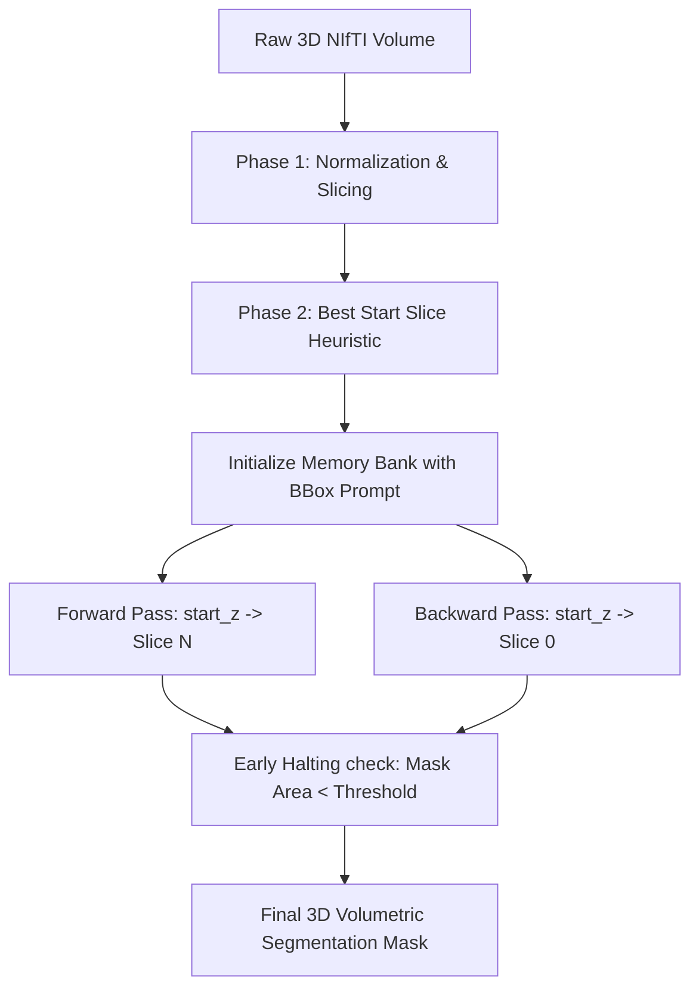

# Volumetric Medical Segmentation via SAM 2 Streaming Memory Attention

This project adapts Meta's **Segment Anything Model 2 (SAM 2)**—originally designed for video tracking—to perform consistent 3D volumetric segmentation on abdominal CT scans from the **BTCV (Beyond the Cranial Vault)** dataset. 

By treating the z-axis (depth) of medical scans as sequential video "frames," this architecture employs SAM 2's streaming memory attention along with custom **Space-Depth (SD-Trans) Adapters** and **Parameter-Efficient Fine-Tuning (LoRA)** to ensure spatial and anatomical coherence across slices.

---

## 1. System Architecture & Workflow

The pipeline treats 3D NIfTI volumes as sequential frames and runs a bidirectional propagation loop anchored by a heuristic start:



### 1.1 Preprocessing Pipeline
1. **Isotropic Resampling**: Voxel dimensions are resampled to a consistent resolution (e.g. $1.5 \times 1.5 \times 1.5 \text{ mm}$) to normalize physical organ scale across patients.
2. **Hounsfield Unit (HU) Windowing**: Soft-tissue structures are isolated by clipping raw HU intensities to a soft-tissue window of $[-150, +250]$.
3. **Pseudo-RGB Formatting**: Clipped HU values are min-max scaled to $[0, 255]$, cast to `uint8`, and duplicated across 3 channels to construct standard pseudo-RGB inputs expected by SAM 2's ViT encoder.

---

## 2. Mathematical Framework

### 2.1 Space-Depth (SD-Trans) Adapters
To allow the frozen 2D ViT image encoder blocks to exchange spatial information across the depth (z) axis, lightweight **Space-Depth Transpose Adapters** are injected into the transformer blocks.

For an input tensor $x \in \mathbb{R}^{B \times N_{\text{tokens}} \times C}$ (or transposed to spatial resolution):
1. **Down Projection**: Projects features to a bottleneck dimension $d_{\text{bottleneck}} \ll C$ (typically 64).
2. **Depth Layer**: Learns spatial interactions.
3. **Up Projection**: Projects features back to $C$.
4. **Learnable Scale**: Scales the adapter's contribution using a learnable parameter $\gamma$ initialized to 0.

$$x_{\text{adapted}} = x_{\text{in}} + \gamma \cdot \text{UpProj}\Big(\text{GELU}\big(\text{DepthLayer}\big(\text{GELU}(\text{DownProj}(x_{\text{in}}))\big)\big)\Big)$$

### 2.2 Low-Rank Adaptation (LoRA)
To adapt the attention mechanisms efficiently, Low-Rank matrix updates are applied to the linear layers. For a linear layer $h = W_0 x$, the update is modeled as:

$$h = W_0 x + \frac{\alpha}{r} B A x$$

Where:
- $W_0 \in \mathbb{R}^{d_{\text{out}} \times d_{\text{in}}}$ is the frozen pre-trained weight matrix.
- $A \in \mathbb{R}^{r \times d_{\text{in}}}$ is initialized using Kaiming Uniform.
- $B \in \mathbb{R}^{d_{\text{out}} \times r}$ is zero-initialized, ensuring the adapter is an identity mapping at step 0.
- $r$ is the rank (default: 8) and $\alpha$ is the scaling factor (default: 16).

In **Option A (PEFT)**, LoRA targets the fused `qkv` projection. In **Option B (Custom)**, updates are strictly mapped to the Query ($Q$) and Value ($V$) projections while zeroing the Key ($K$) updates.

### 2.3 Optimization Loss Function
The model is optimized using a hybrid loss consisting of spatial overlap (Dice) and pixel-level classification (Binary Cross-Entropy) terms:

$$\mathcal{L}_{\text{Total}} = \lambda \mathcal{L}_{\text{Dice}} + (1 - \lambda) \mathcal{L}_{\text{BCE}}$$

#### Volumetric Dice Loss
$$\mathcal{L}_{\text{Dice}} = 1 - \frac{2 \sum_i p_i g_i + \epsilon}{\sum_i p_i^2 + \sum_i g_i^2 + \epsilon}$$

#### Binary Cross-Entropy Loss
$$\mathcal{L}_{\text{BCE}} = -\frac{1}{N} \sum_{i=1}^N \big[ g_i \log p_i + (1 - g_i) \log(1 - p_i) \big]$$

Where $p_i$ is the predicted probability, $g_i$ is the ground-truth binary label, and $\epsilon$ is a smoothing constant to prevent division by zero.

---

## 3. Propagation & Memory Mechanisms

### 3.1 Dual-Memory Bank
Boundary over-propagation (where the tracker continues mapping an organ into slices where it has physically ended) is solved by maintaining two distinct memory buffers:
* **Short-Term Memory**: Stores the features of the preceding $k$ slices to capture smooth, fluid topological changes.
* **Long-Term Memory**: Permanently anchors to the user's starting prompt slice, regularizing the tracking process and preventing the mask from drifting into background tissue.

### 3.2 Bidirectional Propagation Loop
1. **Best Slice Selection**: Selects the slice $i$ containing the largest organ area to minimize prompt ambiguity.
2. **Forward Tracking**: Propagates forward from slice $i \to N$. Halts early if the predicted mask area drops below `min_area_pixels`.
3. **Backward Tracking**: Resets short-term memory, anchors back to slice $i$, and propagates backward from slice $i \to 0$.

---

## 4. Evaluation Metrics

Evaluations are computed on 3D volumetric masks against the ground truth using:
1. **3D Dice Similarity Coefficient (DSC)**: Measures overall volumetric overlap.
2. **95th-Percentile 3D Hausdorff Distance (HD95)**: Captures maximum boundary errors in millimeters (reordered to $z, y, x$ physical spacing):
   $$\text{HD95}(X, Y) = \max \big( d_{95}(X, Y), d_{95}(Y, X) \big)$$
3. **Volumetric Prediction Error (VPE)**: Measures volumetric prediction discrepancy in cubic centimeters ($\text{cm}^3$):
   $$\text{VPE} = \big| \text{Vol}_{\text{pred}} - \text{Vol}_{\text{gt}} \big|$$

---

## 5. Directory Structure

```text
├── configs/
│   └── default.yaml         # Centralized hyperparameter and path config
├── scripts/
│   ├── 01_preprocess.py     # Isotropic resampling, windowing, slicing to PNG
│   ├── 02_run_inference.py  # Performs bidirectional inference on a case
│   ├── 03_train_lora.py     # PEFT fine-tuning (LoRA + SD-Trans Adapters)
│   └── 04_evaluate.py       # Validation split evaluation
├── src/
│   ├── data/
│   │   ├── dataset.py       # BTCVSliceDataset slice loader
│   │   ├── nifti_io.py      # Volumetric NIfTI loading and HU preprocessing
│   │   └── volume_to_frames.py # Volume slicing utilities
│   ├── engine/
│   │   ├── predictor.py     # SAM2 predictor builder
│   │   └── propagate.py     # Bidirectional loop & early halting implementation
│   ├── train/
│   │   ├── adapters.py      # Space-Depth (SD-Trans) adapter definitions
│   │   ├── lora.py          # PEFT/custom LoRA injections & trainable param reports
│   │   ├── losses.py        # Dice + BCE hybrid losses
│   │   └── train.py         # Float32 training loop with gradient accumulation
│   └── eval/
│       ├── evaluate.py      # Validation-set evaluator
│       └── metrics.py       # DSC, HD95, and VPE metric equations
```

---

## 6. Execution Instructions

### 6.1 Environment Setup
Install the core requirements:
```bash
pip install -r requirements.txt
```

### 6.2 Preprocessing
Slice raw 3D volumes into pseudo-RGB axial PNG frames:
```bash
python scripts/01_preprocess.py
```

### 6.3 Parameter-Efficient Fine-Tuning
Train the model on a specific organ (e.g. `6` for Liver) using Space-Depth Adapters and LoRA:
```bash
python scripts/03_train_lora.py --organ 6 --sd-adapter
```
*Weights are saved to `checkpoints/lora_organ6.pt`.*

### 6.4 Bidirectional Volume Inference
Run zero-shot or LoRA inference on a single 3D volume:
```bash
python scripts/02_run_inference.py --case img0035 --organ 6 --lora checkpoints/lora_organ6.pt
```

### 6.5 Full Split Evaluation
Evaluate and print zero-shot vs. fine-tuned performance statistics on the validation cases:
```bash
python scripts/04_evaluate.py --organ 6 --lora checkpoints/lora_organ6.pt
```
